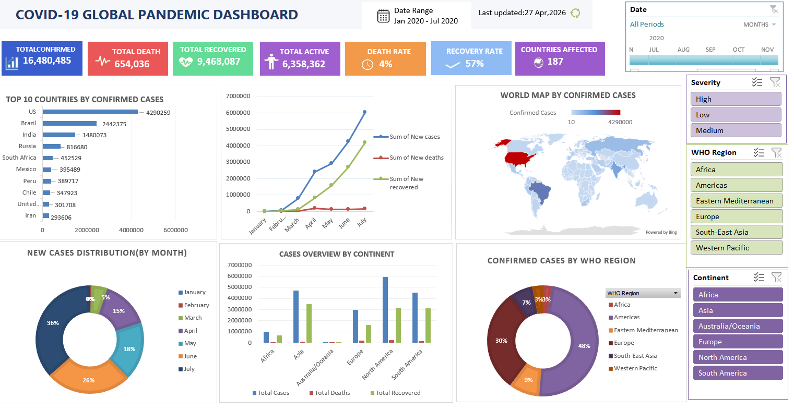

# 📊 COVID-19 Global Analytics Dashboard (Excel)



---

## 🔷 Project Overview

This project presents a fully interactive **COVID-19 Global Analytics Dashboard** built using **Microsoft Excel**.
It transforms raw pandemic data into meaningful insights through structured visualization and dynamic interaction.

The dashboard enables users to analyze trends, compare regions, and monitor key metrics in a clean and intuitive interface.

---

## 🎯 Objectives

* Analyze global COVID-19 trends (Jan 2020 – Jul 2020)
* Identify high-impact countries and regions
* Enable interactive filtering for better exploration
* Present insights using a professional dashboard layout

---

## ⚙️ Tech Stack

* Microsoft Excel
* Pivot Tables & Pivot Charts
* Slicers & Timeline
* Data Cleaning & Transformation
* Dashboard Design Principles

---

## 📌 Key Features

### 📈 KPI Metrics

* Total Confirmed Cases
* Total Deaths
* Total Recovered
* Active Cases
* Death Rate & Recovery Rate

### 🌍 Interactive Visualizations

* Top 10 Countries by Confirmed Cases (Bar Chart)
* Global Trend Analysis (Line Chart)
* Monthly Distribution (Donut Chart)
* Region-wise Analysis (WHO Regions)
* Continent-wise Comparison (Column Chart)
* World Map Visualization

### 🎛️ Interactivity

* Timeline for date filtering
* Slicers:

  * Continent
  * WHO Region
  * Severity

All visual elements dynamically update based on user selection.

---

## 🧠 Data Preparation

* Standardized inconsistent date formats
* Removed null and zero-value entries
* Converted text fields into proper data types
* Structured dataset for pivot-based analysis

---

## 🎨 Dashboard Design Approach

* Grid-based layout for structured alignment
* Minimal and meaningful color palette:

  * 🔵 Confirmed Cases
  * 🔴 Deaths
  * 🟢 Recovered
* Card-based KPI representation
* Clean spacing and alignment for readability

---

## 📊 Key Insights

* North America recorded the highest number of confirmed cases
* Rapid growth observed between March and June 2020
* Recovery rate improved steadily over time
* Significant variation across WHO regions

---

## 🚀 How to Use

1. Download the Excel file
2. Open in Microsoft Excel
3. Use slicers and timeline to filter data
4. Interact with charts to explore insights

---

## 📄 Documentation

Detailed project documentation:
👉 [Download PDF](COVID19_Dashboard_Project_Documentation.pdf)

---

## 📁 Project Structure

```
COVID19-Dashboard/
│
├── dashboard.xlsx
├── images/
│   └── dashboard-preview.png
├── COVID19_Dashboard_Project_Documentation.pdf
└── README.md
```

---

## 👨‍💻 Author

**Sakshyam Bhandari**

---

## ⭐ Project Highlights

This project demonstrates:

* Strong data cleaning and transformation skills
* Ability to build interactive dashboards in Excel
* Understanding of data visualization principles
* Structured approach to real-world data analysis

---

## 📌 Future Improvements

* Enhance visual design and alignment
* Add more advanced KPIs
* Expand dataset for deeper insights
* Convert dashboard into Power BI for scalability

---

## ⭐ If you found this useful

Feel free to ⭐ star the repository and share feedback!
